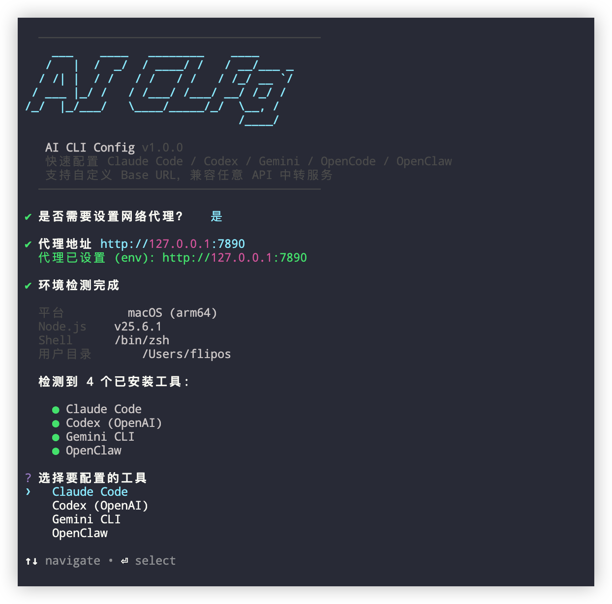

<div align="center">

<h1>⚡ ai-cli-switch</h1>

<p><strong>一条命令，完成所有 AI CLI 工具的 API 配置</strong></p>
<p>Configure Claude Code · Codex · Gemini CLI · OpenCode · OpenClaw in seconds</p>
<p>支持任意 Base URL — 官方 API / 中转服务 / 自建代理</p>


<br/>

[](https://www.npmjs.com/package/ai-cli-switch)
[](https://www.npmjs.com/package/ai-cli-switch)
[](https://www.npmjs.com/package/ai-cli-switch)
[](https://nodejs.org)
[](LICENSE)
[](https://github.com/zxyyang/ai-cli-switch)

<br/>

**🌐 语言 / Language / 언어 / भाषा**

[🇨🇳 中文](README.md) · [🇺🇸 English](README.en.md) · [🇰🇷 한국어](README.ko.md) · [🇮🇳 हिन्दी](README.hi.md)

</div>

---

## ✨ 为什么选择 ai-cli-switch？

你是否遇到过这些问题？

- 🤔 Claude Code / Codex / Gemini 配置文件在哪？格式是什么？
- 😩 每次换 API 中转都要手动改多个配置文件
- 🔑 API Key 配置错了格式导致工具无法使用
- 🌏 国内访问需要中转，不知道怎么配置 Base URL

**ai-cli-switch 解决这一切。** 交互式引导，30 秒完成配置，支持所有主流 AI CLI 工具。

---

## 🚀 快速开始

```bash
npx ai-cli-switch
```

> 无需安装，一行命令即可运行。Node.js >= 18 即可。

或全局安装后使用：

```bash
npm install -g ai-cli-switch
ai-cli-switch
```

---

## 🛠️ 支持的工具

<table>
  <thead>
    <tr>
      <th>工具</th>
      <th>说明</th>
      <th>默认 Base URL</th>
      <th>配置文件</th>
    </tr>
  </thead>
  <tbody>
    <tr>
      <td><b>Claude Code</b></td>
      <td>Anthropic 官方 AI 编程助手</td>
      <td><code>https://api.anthropic.com</code></td>
      <td><code>~/.claude/settings.json</code></td>
    </tr>
    <tr>
      <td><b>Codex</b></td>
      <td>OpenAI 官方 CLI 工具</td>
      <td><code>https://api.openai.com/v1</code></td>
      <td><code>~/.codex/auth.json</code></td>
    </tr>
    <tr>
      <td><b>Gemini CLI</b></td>
      <td>Google Gemini 命令行工具</td>
      <td><code>https://generativelanguage.googleapis.com</code></td>
      <td><code>~/.gemini/.env</code></td>
    </tr>
    <tr>
      <td><b>OpenCode</b></td>
      <td>开源 AI 编程助手（多模型）</td>
      <td>视模型而定</td>
      <td><code>~/.config/opencode/opencode.json</code></td>
    </tr>
    <tr>
      <td><b>OpenClaw</b></td>
      <td>开源 AI 编程助手（多模型）</td>
      <td>视模型而定</td>
      <td><code>~/.openclaw/openclaw.json</code></td>
    </tr>
  </tbody>
</table>

---

## 🌐 支持的 Base URL 类型

| 场景 | Base URL 示例 |
|------|---------------|
| Anthropic 官方 API | `https://api.anthropic.com` |
| OpenAI 官方 API | `https://api.openai.com/v1` |
| Google Gemini 官方 | `https://generativelanguage.googleapis.com` |
| **78code 中转（Claude）** | `https://www.78code.cc` |
| **78code 中转（OpenAI）** | `https://www.78code.cc/v1` |
| 自建本地代理 | `http://127.0.0.1:8080` |
| 任意 OpenAI 兼容接口 | `https://your-api.example.com/v1` |

---

## 📋 使用流程

```
$ npx ai-cli-switch

  1. [可选] 设置网络代理（支持 HTTP/HTTPS 代理）
  2. 自动检测已安装的 AI CLI 工具
  3. 选择要配置的工具
  4. 选择模型类型（OpenCode/OpenClaw 需要）
  5. 输入 Base URL（可修改默认值）
  6. 输入 API Key（密码模式，字符不显示）
  7. 自动测试 API 连通性
  8. 写入配置文件（自动备份原文件）
  9. 自检验证 ✅
```

---

## 🔒 安全设计

- **API Key 不落盘**：输入时完全遮蔽，不写入日志
- **原子写入**：配置写入失败不会破坏原有配置
- **自动备份**：每次写入前备份原文件，格式 `*.bak.{timestamp}`
- **只改密钥字段**：深度合并配置，不会删除你其他的自定义配置

---

## 📦 配置文件格式

<details>
<summary><b>Claude Code</b> — <code>~/.claude/settings.json</code></summary>

```json
{
  "env": {
    "ANTHROPIC_API_KEY": "sk-ant-...",
    "ANTHROPIC_BASE_URL": "https://api.anthropic.com"
  }
}
```
</details>

<details>
<summary><b>Codex</b> — <code>~/.codex/auth.json</code> + <code>config.toml</code></summary>

```json
{ "OPENAI_API_KEY": "sk-..." }
```

```toml
model_provider = "api-openai-com"
disable_response_storage = true

[model_providers.api-openai-com]
name = "api-openai-com"
base_url = "https://api.openai.com/v1"
wire_api = "responses"
requires_openai_auth = true
```
</details>

<details>
<summary><b>Gemini CLI</b> — <code>~/.gemini/.env</code></summary>

```env
GEMINI_API_KEY=AIza...
GOOGLE_GEMINI_BASE_URL=https://generativelanguage.googleapis.com
```
</details>

---

## 🧩 Fork 为你自己的专属版

运营 API 中转服务？可以基于本工具快速定制：

1. Fork 本仓库
2. 修改 `src/index.js` 中的 `DEFAULT_BASE_URLS` 为你的服务地址
3. 修改 `package.json` 的 `name` 和 `bin`
4. 更新 Banner 和完成页面的品牌信息
5. `npm publish` 发布

用户只需 `npx 你的包名` 即可一键配置你的服务 🎉

**示例：** [78code-ai](https://github.com/zxyyang/78code) — 基于本工具为 78code.cc 定制的专属版本

---

## ❓ 常见问题

<details>
<summary>提示"未检测到任何已安装的 AI CLI 工具"</summary>

请先安装对应工具：

```bash
npm install -g @anthropic-ai/claude-code   # Claude Code
npm install -g @openai/codex               # Codex
npm install -g @google/gemini-cli          # Gemini CLI
```
</details>

<details>
<summary>API 连接测试失败怎么办？</summary>

- 检查 Base URL 末尾不要有 `/`
- 确认 API Key 正确且有余额
- 国内网络请在启动时配置代理（工具会提示）
- 测试失败后仍可选择"继续写入配置"
</details>

<details>
<summary>如何验证配置是否生效？</summary>

```bash
# Claude Code
cat ~/.claude/settings.json

# Gemini CLI
cat ~/.gemini/.env

# Codex
cat ~/.codex/auth.json
```
</details>

---

## 🤝 贡献

欢迎提交 PR 和 Issue！如果这个工具对你有帮助，请点个 ⭐ Star，让更多人发现它。

---

<div align="center">

**如果觉得有用，请给个 ⭐ Star 支持一下！**

[](https://star-history.com/#zxyyang/ai-cli-switch&Date)

Made with ❤️ · [npm](https://www.npmjs.com/package/ai-cli-switch) · [Issues](https://github.com/zxyyang/ai-cli-switch/issues)

</div>
